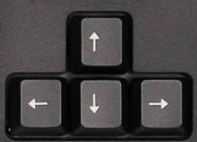
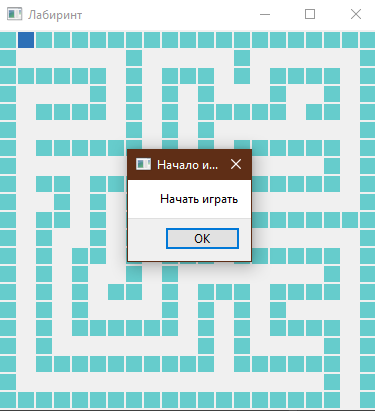
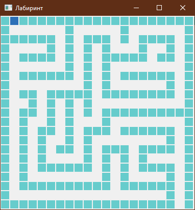
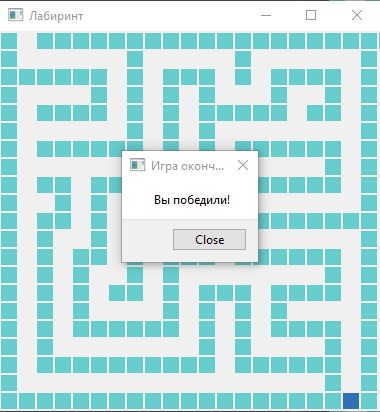

# Краткая характеристика: 

* **Наименование программы:** Лабиринт.
* **Назначение:** Программа преднозначена для отдыха.
* **Конечные пользователи:** Дети, подростки, взрослые.

# Техническое задание
Каждому человеку охото порой отойти от суеты внешнего мира и отдохнуть. Для это была создана моя программа в которой  развивается логическое мышленеи и быстрое понимание окружаешей среды.

Программа включает в себя:

* **Прохождение уровня**

*Важно помнить, что программа не сможет заменить общение и решение разнообразных логических задач*.
# Сборка и запуск
Разработка и тестирование программы было осуществлено в операционной системе **Windows 10 (Home)**. Для успешного запуска и нормальной работы должны быть установлены следующие библеотеки:

* **библиотека PyQt 5**
* **библеотека sys** 

*Данная программа была написана на языке Python 3.10*

# Управление
Управление в данной прогрмме происходит с помощь нажатия стрелок: вверх, вниз, налево и направо.

При помощи клавиши вниз - вы можете двигаться вниз.

При помощи клавиши вверх - вы можете двигаться вверх.

При помощи клавиши направо - вы можете двигаться направо.

При помощи клавиши налево - вы можете двигаться налево.

# Интерфейс

После старта программы появляется 1 кнопка:

* **Начать игру**
* **Close**

#### Кнопка *Начать игру* :
Открывается окно, где вы можете увидеть игровое поле.

#### Кнопка *Close* :

Она появляется после прохождения лабиринта.
После нажатия на которую, окно закрывается.

